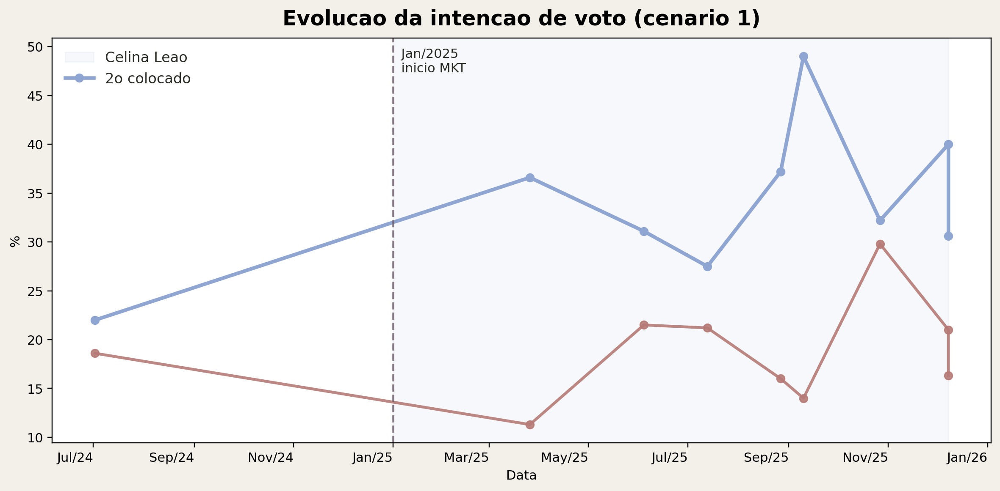
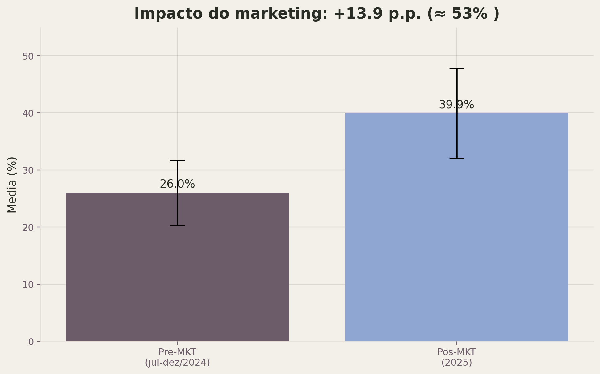
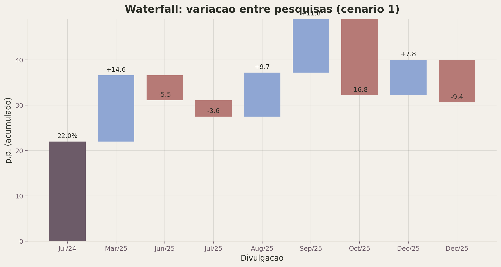
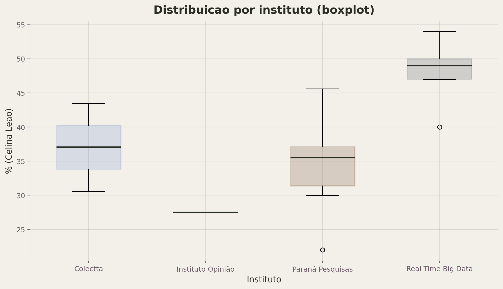
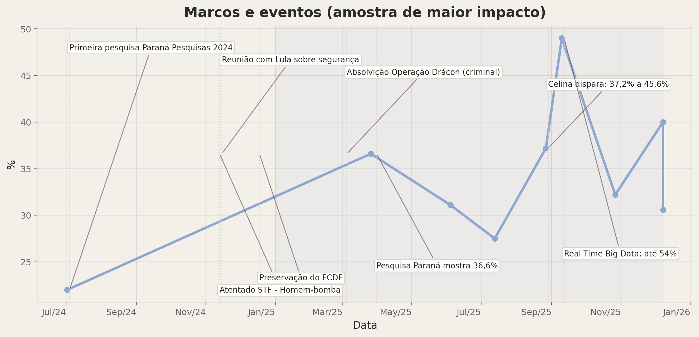

# Celina Leao 2024-2025

Evolucao de campanha, impacto de publicidade e consolidacao de marca (DF 2026)

---

## Resultados-chave

- Media geral: **38.4%**
- Lift pos-MKT: **+13.9 p.p.** (≈ 53%)
- Pico: **54%** (Sep/2025)

---

## Evolucao

---

## Antes vs depois

---

## Mudanca de tendencia

---

## Consistencia por instituto

---

## Cenario competitivo

---

## Volatilidade (waterfall)

---

## Distribuicao por instituto

---

## Marcos e eventos

---

## Conclusao

- Hipotese confirmada no agregado: aumento consistente apos Jan/2025.
- Leituras: comunicacao + agenda + eventos funcionam como alavancas de marca.
- Proximo passo: tracking padronizado + metricas de midia (SoV/sentimento/busca).
